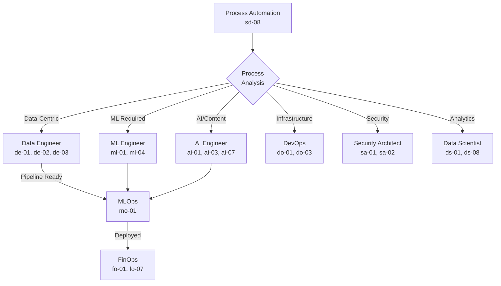

# Skill 8: Process Automation Analysis & Planning

## Overview

A comprehensive skill for analyzing work processes, identifying automation opportunities, creating implementation plans, and mapping the right roles/skills to execute automation initiatives.

## Connections

| Role | Connection Type | Purpose | Key Skills |
|------|----------------|---------|------------|
| **All Roles** | Downstream | Routes automation tasks to appropriate specialists | All skills |
| **Data Engineer** | Primary | Automates data pipelines, ETL, data quality | de-01, de-02, de-03 |
| **ML Engineer** | Primary | Automates model training, deployment, monitoring | ml-01, ml-02, ml-04 |
| **AI Engineer** | Primary | Automates content generation, RAG, agents | ai-01, ai-02, ai-03, ai-07 |
| **DevOps** | Primary | Automates CI/CD, infrastructure, deployments | do-01, do-03, do-04, do-08 |
| **Security Architect** | Supporting | Ensures compliance in automated processes | sa-01, sa-02, sa-06 |
| **Data Scientist** | Supporting | Analyzes process metrics, identifies patterns | ds-01, ds-08 |
| **FinOps** | Supporting | Cost analysis for automation ROI | fo-01, fo-03, fo-07 |
| **System Design** | Supporting | Architecture patterns for automation systems | sd-01, sd-05 |

## Tools Included

### 1. `process_analyzer.py`
Analyzes existing work processes to identify automation candidates.

**Features:**
- Process decomposition into steps and tasks
- Automation feasibility scoring (0-100)
- Bottleneck identification
- Time/cost analysis per process step
- Complexity classification (simple, moderate, complex, enterprise)

### 2. `automation_recommender.py`
Recommends optimal automation strategies based on process characteristics.

**Features:**
- Automation pattern matching (RPA, workflow, ML-based, AI-powered)
- Tool and technology recommendations
- Build vs. buy analysis
- Risk assessment
- Priority ranking by ROI

### 3. `role_matcher.py`
Maps processes to the most suitable roles and skills for implementation.

**Features:**
- Skill requirement extraction from process analysis
- Role affinity scoring
- Team composition recommendations
- Skill gap identification
- Cross-functional dependency mapping

### 4. `plan_generator.py`
Generates comprehensive automation implementation plans.

**Features:**
- Phase-based implementation roadmap
- Milestone and deliverable definitions
- Resource requirements
- Risk mitigation strategies
- Documentation templates (ADRs, PRDs, technical specs)

### 5. `process_parser.py` (AI-Ready)
Parses natural language process descriptions for AI-driven analysis.

**Features:**
- Markdown and plain text parsing
- Automatic step extraction from numbered lists
- Pain point and bottleneck detection
- Tool and data source identification
- Confidence scoring for parsed data

### 6. `ai_prompt_generator.py` (AI-Ready)
Generates optimized prompts for AI assistants (GitHub Copilot, Claude, ChatGPT).

**Features:**
- Multiple prompt styles (Copilot, Structured, Step-by-step)
- Configurable analysis depth
- Follow-up prompt suggestions
- Tech Hub context injection
- Implementation-ready code prompts

### 7. `PROCESS_TEMPLATE.md`
Ready-to-use template for documenting processes for AI analysis.

---

## AI-Driven Automation Discovery

### The Dynamic Workflow

This skill is designed to work seamlessly with AI assistants. Simply write your process in natural language, and the AI will suggest automation solutions.

```

  Write Process Doc    ← Use PROCESS_TEMPLATE.md
  (Natural Language) 

           

   Process Parser      ← Extracts structured data
   (Automatic)       

           

  AI Prompt Generator  ← Creates optimized prompts
                     

           

  GitHub Copilot /     ← Analyzes and suggests
  Claude / ChatGPT   

           

  Automation Plan +    ← Ready to implement!
  Code Snippets      

```

### Quick Start: VS Code + GitHub Copilot

**Method 1: One-Line Analysis**

```python
from ai_prompt_generator import quick_analyze

# Paste your process description
process = """
# Monthly Invoice Processing
Every month we process 200+ invoices manually...
[Your full process description]
"""

# Get the prompt for Copilot
prompt = quick_analyze(process)
print(prompt)  # Copy this to Copilot Chat!
```

**Method 2: Full Pipeline**

```python
from process_parser import ProcessParser
from ai_prompt_generator import AIPromptGenerator, PromptStyle, AnalysisDepth

# 1. Parse your process documentation
parser = ProcessParser()
with open('my_process.md', 'r') as f:
    parsed = parser.parse(f.read())

# 2. Generate AI prompt
generator = AIPromptGenerator()
result = generator.generate_discovery_prompt(
    parsed,
    style=PromptStyle.COPILOT,
    depth=AnalysisDepth.IMPLEMENTATION
)

# 3. Use the prompt
print(result.prompt)           # Main prompt for Copilot
print(result.follow_up_prompts)  # Follow-up questions
```

**Method 3: Direct Template**

1. Copy `PROCESS_TEMPLATE.md` to your project
2. Fill in your process details
3. Open GitHub Copilot Chat
4. Paste the entire document and ask:
   > "Analyze this process and suggest automation solutions"

### Prompt Styles

| Style | Best For | Output |
|-------|----------|--------|
| `COPILOT` | VS Code GitHub Copilot | Structured with code snippets |
| `STRUCTURED` | JSON/YAML workflows | Machine-readable format |
| `STEP_BY_STEP` | Complex processes | Iterative deep dive |
| `DETAILED` | Comprehensive analysis | Full documentation |
| `CONVERSATIONAL` | Exploration | Chat-style discovery |

### Analysis Depths

| Depth | Time | Output |
|-------|------|--------|
| `QUICK` | ~1 min | Top 3 opportunities |
| `STANDARD` | ~3 min | Balanced analysis |
| `DEEP` | ~5 min | Edge cases, optimization |
| `IMPLEMENTATION` | ~10 min | Production-ready code |

---

## Automation Patterns

### Pattern Categories

| Pattern | Use When | Primary Role | Complexity |
|---------|----------|--------------|------------|
| **RPA (Robotic Process Automation)** | Repetitive, rule-based tasks | DevOps | Low |
| **Workflow Automation** | Multi-step business processes | Data Engineer | Medium |
| **Data Pipeline Automation** | ETL/ELT, data quality | Data Engineer | Medium |
| **ML-Based Automation** | Prediction, classification tasks | ML Engineer | High |
| **AI-Powered Automation** | Content generation, reasoning | AI Engineer | High |
| **Infrastructure Automation** | Provisioning, scaling | DevOps | Medium |
| **Security Automation** | Compliance, monitoring | Security Architect | Medium |

### Decision Matrix

```
Process Characteristics → Recommended Automation

High Volume + Low Complexity → RPA
High Volume + Medium Complexity → Workflow Automation
Data-Centric + Transformations → Data Pipeline
Prediction Required → ML-Based
Natural Language/Content → AI-Powered
Infrastructure Related → IaC/DevOps
Security/Compliance → Security Automation
```

## Quick Start

```python
from process_analyzer import ProcessAnalyzer
from automation_recommender import AutomationRecommender
from role_matcher import RoleMatcher
from plan_generator import PlanGenerator

# 1. Analyze the process
analyzer = ProcessAnalyzer()
analysis = analyzer.analyze_process(
    name="Monthly Report Generation",
    description="Generate monthly sales reports from multiple data sources",
    steps=[
        {"name": "Extract data from CRM", "time_minutes": 30, "manual": True},
        {"name": "Extract data from ERP", "time_minutes": 45, "manual": True},
        {"name": "Merge and clean data", "time_minutes": 60, "manual": True},
        {"name": "Calculate metrics", "time_minutes": 30, "manual": True},
        {"name": "Generate visualizations", "time_minutes": 45, "manual": True},
        {"name": "Write summary", "time_minutes": 60, "manual": True},
        {"name": "Review and send", "time_minutes": 30, "manual": True}
    ],
    frequency="monthly",
    stakeholders=["Sales", "Finance", "Executive"]
)

# 2. Get automation recommendations
recommender = AutomationRecommender()
recommendations = recommender.recommend(analysis)

# 3. Match to roles and skills
matcher = RoleMatcher()
team = matcher.match_roles(analysis, recommendations)

# 4. Generate implementation plan
planner = PlanGenerator()
plan = planner.generate_plan(
    analysis=analysis,
    recommendations=recommendations,
    team_composition=team
)

# Output the plan
print(plan.to_markdown())
```

## Output Example

```markdown
# Automation Plan: Monthly Report Generation

## Executive Summary
- **Automation Potential**: 85/100
- **Estimated Time Savings**: 4.5 hours/month
- **Recommended Approach**: Data Pipeline + AI-Powered

## Recommended Team
| Role | Skills Required | Effort |
|------|-----------------|--------|
| Data Engineer | de-02 (ETL), de-03 (Quality) | 60% |
| AI Engineer | ai-01 (Prompts), ai-07 (LLM API) | 30% |
| DevOps | do-01 (CI/CD), do-08 (Monitoring) | 10% |

## Implementation Phases
### Phase 1: Data Pipeline (Week 1-2)
- Set up automated data extraction from CRM/ERP
- Implement data quality checks
- Create merge and transformation logic

### Phase 2: Analytics Automation (Week 3)
- Automate metric calculations
- Set up visualization generation
- Configure scheduled runs

### Phase 3: AI Integration (Week 4)
- Implement LLM-based summary generation
- Add quality checks for generated content
- Set up review workflow

## Success Metrics
- Report generation time < 30 minutes
- Manual intervention < 10%
- Stakeholder satisfaction > 4/5
```

## Process Complexity Levels

### Simple (Automation Score: 80-100)
- Linear workflow, few decision points
- Standard data formats
- Single system involved
- **Time to automate**: Days to 1 week

### Moderate (Automation Score: 60-79)
- Some branching logic
- Multiple data sources
- Moderate transformations
- **Time to automate**: 1-2 weeks

### Complex (Automation Score: 40-59)
- Many decision points
- Unstructured data handling
- Multiple system integrations
- ML/AI components needed
- **Time to automate**: 2-4 weeks

### Enterprise (Automation Score: 20-39)
- Cross-departmental processes
- Compliance requirements
- Legacy system integration
- Human-in-the-loop required
- **Time to automate**: 1-3 months

## Integration with Tech Hub Skills

This skill connects to all other Tech Hub skills through the central orchestrator:



## Best Practices

### Process Analysis
1. **Start with observation** - Document current state before recommending changes
2. **Measure everything** - Capture time, cost, error rates for each step
3. **Identify stakeholders** - Understand who benefits and who's impacted
4. **Find the bottlenecks** - Focus automation on highest-impact areas

### Automation Selection
1. **Start simple** - Automate easy wins first to build momentum
2. **Consider maintenance** - Factor in ongoing operational costs
3. **Plan for exceptions** - Design graceful fallbacks for edge cases
4. **Security first** - Involve Security Architect early for sensitive processes

### Implementation
1. **Iterate incrementally** - Automate in phases, not all at once
2. **Keep humans in the loop** - Maintain oversight for critical decisions
3. **Monitor continuously** - Set up alerts for automation failures
4. **Document thoroughly** - Future maintainers will thank you

## Metrics & KPIs

| Metric | Description | Target |
|--------|-------------|--------|
| **Time Saved** | Hours saved per execution | >70% reduction |
| **Error Rate** | Errors per 100 executions | <5% |
| **Adoption Rate** | % of processes automated | >60% candidates |
| **ROI** | (Value gained - Cost) / Cost | >200% Year 1 |
| **MTTR** | Mean time to resolve failures | <30 minutes |

## Related Skills

- `sd-01`: Architecture Pattern Selection
- `sd-02`: Requirements Engineering
- `sd-05`: Cost Optimization Design
- `de-02`: ETL/ELT Pipeline Orchestration
- `ml-01`: MLOps Pipeline Automation
- `ai-03`: LLM Agent Orchestration
- `do-01`: CI/CD Pipeline Design

---

## Advanced AI Workflows

### Comparing Automation Approaches

```python
from process_parser import ProcessParser
from ai_prompt_generator import AIPromptGenerator

parser = ProcessParser()
parsed = parser.parse(process_doc)

generator = AIPromptGenerator()
comparison = generator.generate_comparison_prompt(
    parsed,
    approaches=[
        "Azure Logic Apps + Power Automate",
        "Python + Airflow",
        "Azure Data Factory",
        "Custom microservices"
    ]
)

print(comparison.prompt)  # Asks AI to compare approaches
```

### Getting Implementation Code

```python
# Get code for a specific step
impl_prompt = generator.generate_implementation_prompt(
    parsed,
    target_step=2,      # Step number to implement
    technology="python"  # Or "terraform", "sql", etc.
)

print(impl_prompt.prompt)  # Paste in Copilot for working code
```

### Iterative Refinement

The AI-driven workflow supports iterative refinement:

1. **Initial Analysis** → Get broad automation suggestions
2. **Deep Dive** → Ask follow-up questions on specific areas
3. **Implementation** → Request code for chosen approach
4. **Review** → Ask AI to review and improve code
5. **Documentation** → Generate ADRs, runbooks, tests

### Example: Full Automation Discovery Session

```python
# Session workflow
from process_parser import ProcessParser
from ai_prompt_generator import AIPromptGenerator, PromptStyle, AnalysisDepth

# Step 1: Document your process
process_doc = open('my_process.md').read()

# Step 2: Parse and analyze
parser = ProcessParser()
parsed = parser.parse(process_doc)

print(f"Parsed {len(parsed.steps)} steps with {parsed.confidence_score}% confidence")
print(f"Pain points detected: {parsed.pain_points}")
print(f"Tools found: {parsed.current_tools}")

# Step 3: Generate discovery prompt
generator = AIPromptGenerator()
discovery = generator.generate_discovery_prompt(
    parsed,
    style=PromptStyle.COPILOT,
    depth=AnalysisDepth.STANDARD
)

print("=" * 50)
print("PASTE THIS INTO GITHUB COPILOT CHAT:")
print("=" * 50)
print(discovery.prompt)

# Step 4: After getting response, use follow-ups
print("\nFOLLOW-UP QUESTIONS:")
for q in discovery.follow_up_prompts:
    print(f"  → {q}")

# Step 5: Request implementation for chosen approach
impl = generator.generate_implementation_prompt(
    parsed,
    target_step=1,
    technology="python"
)
```

### Integration with Existing Tools

The AI prompt generator includes Tech Hub context, so responses will reference:

- Relevant Tech Hub skills (de-01, ai-02, ml-04, etc.)
- Azure-native services
- Production-ready patterns
- Team role recommendations

This ensures AI suggestions align with your organization's capabilities.

---

## File Reference

| File | Purpose | When to Use |
|------|---------|-------------|
| `PROCESS_TEMPLATE.md` | Document your process | Starting point - copy and fill in |
| `process_parser.py` | Parse documentation | Automatic - called by other tools |
| `ai_prompt_generator.py` | Generate AI prompts | When using Copilot/Claude/ChatGPT |
| `process_analyzer.py` | Structured analysis | For programmatic analysis |
| `automation_recommender.py` | Strategy recommendations | After analysis |
| `role_matcher.py` | Team composition | When planning implementation |
| `plan_generator.py` | Full implementation plan | Final planning step |

---

**Skill ID**: `sd-08`
**Complexity**: Medium
**Dependencies**: `sd-01`, `sd-02`
**Estimated Time**: 2-8 hours (per process analysis)
**Business Value**: High
